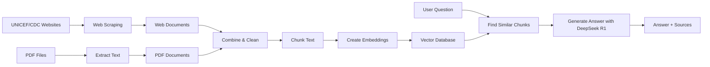

# 🚀 Parenting & Child Psychology RAG Pipeline

A Retrieval-Augmented Generation (RAG) system to help parents understand child behavior and psychology using AI-powered question answering.

## 📋 Overview

This Jupyter notebook implements a complete RAG pipeline that:
- **Automatically scrapes** parenting content from UNICEF and CDC websites
- Loads parenting guides and psychology texts from PDF files
- Extracts, cleans, and chunks the text content
- Creates semantic embeddings using Embedding Gemma (runs locally!)
- Stores them in a ChromaDB vector database
- Answers questions using DeepSeek R1 (via OpenRouter - FREE!)
- Provides source citations for transparency

## 🎯 Features

- ✅ **Web Scraping**: Automatically download content from UNICEF & CDC
- ✅ **PDF Processing**: Extract text from multiple parenting guides
- ✅ **Smart Chunking**: ~1000 token chunks with overlap for context
- ✅ **FREE Local Embeddings**: Google Embedding Gemma (300M) runs on your machine
- ✅ **Semantic Search**: Find the most relevant information
- ✅ **AI-Powered Answers**: DeepSeek R1 generates comprehensive responses (via OpenRouter)
- ✅ **Source Citations**: See which documents informed each answer
- ✅ **Interactive Queries**: Ask your own parenting questions
- ✅ **100% FREE**: No API costs - both embedding and LLM are free!
- ✅ **Privacy-First**: Embeddings processed locally on your machine

## 🔧 Setup

### Prerequisites

1. **Python 3.8+** installed
2. **Hugging Face account** (free) to accept Embedding Gemma license
3. **OpenRouter API Key** for DeepSeek R1 (get one at https://openrouter.ai/keys - free tier available!)
4. **4GB+ RAM** for running Embedding Gemma locally
5. **~1.5GB disk space** for model cache (one-time download)

### Installation

```powershell
# Set your OpenRouter API key
$env:OPENROUTER_API_KEY = "your-openrouter-key-here"

# Optional: Set Hugging Face token for faster model downloads
$env:HF_TOKEN = "your-hf-token-here"

# The notebook will install all required packages automatically
```

**Accept Embedding Gemma License** (one-time, free):
1. Go to: https://huggingface.co/google/embeddinggemma-300m
2. Sign in to Hugging Face (or create free account)
3. Click "Accept" to agree to the license terms

### Required Packages

The notebook automatically installs:
- `pdfplumber` - PDF text extraction
- `langchain-core` - Core LangChain functionality
- `langchain-text-splitters` - Text chunking utilities
- `langchain-community` - Community integrations
- `chromadb` - Vector database
- `tiktoken` - Token counting
- `openai` - OpenAI API client (used for OpenRouter)
- `sentence-transformers` - For Embedding Gemma model
- `beautifulsoup4` - Web scraping HTML parser
- `requests` - HTTP library for web scraping
- `playwright` - Browser automation for web scraping

## 📂 Project Structure

Notebook-only (original):
```
parenting-and-child/
├── parenting_rag_pipeline.ipynb  # Main notebook
├── parenting_articles.csv        # Source CSV (sample dataset)
├── chroma_db/                    # Vector database (auto-created)
│   └── ...
└── data/                        # PDF documents folder (optional user PDFs)
```

New Python module version (scripted):
```
parenting-and-child/
├── config.py                # Central configuration constants
├── embeddings.py            # Embedding wrapper (SentenceTransformer)
├── vectorstore_build.py     # Build or load Chroma collection from CSV
├── rag.py                   # Retrieval + prompt assembly + LLM call
├── llm.py                   # OpenRouter/OpenAI client with graceful fallback
├── main.py                  # CLI entry point (end-to-end RAG)
├── requirements.txt         # Python dependencies
├── parenting_articles.csv   # Source data
├── chroma_db/               # Persistent Chroma store
└── data/                    # Optional PDF files
```

> You can now run everything outside the notebook using `main.py`.

## 🚀 Getting Started

### Step 1: Accept Embedding Gemma License

1. Visit: https://huggingface.co/google/embeddinggemma-300m
2. Sign in to Hugging Face (or create a free account)
3. Click "Accept" to agree to the license terms (one-time)

### Step 2: Set API Key

```powershell
# Windows PowerShell
$env:OPENROUTER_API_KEY = "sk-your-openrouter-key-here"

# Optional: For faster model downloads
$env:HF_TOKEN = "your-hf-token-here"

# Or set them permanently in Windows System Environment Variables
```

Get your keys:
- **OpenRouter**: https://openrouter.ai/keys (Free tier - no credit card!)
- **Hugging Face** (optional): https://huggingface.co/settings/tokens

### Step 3: Run the Notebook (Option A)

1. Open `parenting_rag_pipeline.ipynb` in VS Code or Jupyter
2. Run all cells from top to bottom
3. The notebook will:
   - **Automatically scrape** UNICEF and CDC websites for parenting content
   - Process any PDF files you've added to the `data/` folder (optional)
   - Create embeddings using Embedding Gemma (downloaded once, ~1.2GB)
   - Build a vector database with all content
4. Use the interactive query cell to ask questions!

### Step 4: Run as Python Scripts (Option B)

Install dependencies (inside your environment):

```powershell
pip install -r requirements.txt
```

Force (re)build vector store and query:
```powershell
python main.py --rebuild -q "How can I deal with my child's tantrums?"
```

Subsequent queries reuse existing Chroma collection:
```powershell
python main.py -q "How do I encourage emotional regulation?" -k 5
```

If the LLM API key is missing or invalid the answer section will show a fallback message while retrieval still works (chunks + sources).

Windows note (file lock / PermissionError):
- If you see a PermissionError when deleting `chroma_db` (WinError 32), close any Jupyter kernels or Python processes using the DB.
- Or direct the database to a fresh folder with `--db-dir`:
```powershell
python main.py --rebuild --db-dir "chroma_db2" -q "How can I deal with my child's tantrums?"
```

### Step 5: (Optional) Add Your Own PDFs

## 📥 Scrape UNICEF & CDC parenting pages to text files

You can automatically collect a small set of parenting documents from UNICEF and CDC and save each as a readable text file into `data/`:

```powershell
# Install dependencies (if not already)
pip install -r requirements.txt

# Scrape up to 30 pages, save up to 20 documents, 1 second between requests
python scrape_sources.py --max-pages 30 --max-docs 20 --delay 1.0
```

What it does:
- Starts from official parenting resource pages (UNICEF Parenting, CDC Parenting/Essentials).
- Follows only domain-allowed links that look parenting-related.
- If the link is a PDF, downloads directly as `.pdf`.
- If the link is HTML, extracts the main text and saves as a plain `.txt` file (UTF-8 encoded, directly readable).

Notes:
- The script is intentionally conservative and polite (rate limited).
- Text files include article titles and are human-readable in any text editor.
- If websites block automated access, reduce `--max-pages` and increase `--delay` or retry later.

You can supplement the web-scraped content with your own PDF documents:
- Place PDF files in the `data/` folder
- The notebook will automatically include them in the knowledge base

## 💡 Example Questions

Try asking questions like:

- "How can I deal with my child's tantrums?"
- "What are positive ways to manage child anger according to psychology experts?"
- "How do I help my child develop emotional intelligence?"
- "What are effective discipline strategies for toddlers?"
- "How can I encourage positive behavior in my child?"

## 📊 How It Works



1. **Web Scraping**: Automatically download content from UNICEF and CDC
2. **PDF Loading**: Extract text from parenting guides (optional)
3. **Text Cleaning**: Remove artifacts and normalize formatting
4. **Chunking**: Split into ~1000 token pieces with metadata
5. **Embedding**: Create vector embeddings with Embedding Gemma (runs locally!)
6. **Storage**: Store in ChromaDB for fast retrieval
7. **Query**: Find top 3 most relevant chunks
8. **Generate**: Use DeepSeek R1 (via OpenRouter) to create a comprehensive answer
9. **Cite**: Show which sources informed the answer

**All processing happens on your machine** - Maximum privacy!

## 💰 Cost Estimates

- **Web Scraping**: **$0.00** - Free public content
- **Embeddings** (Embedding Gemma): **$0.00** - Runs locally on your machine!
- **DeepSeek R1** (OpenRouter free tier): **$0.00** - FREE with rate limits
- **Typical query**: **$0.00** per question

**Total cost**: **$0.00** - Completely FREE! 🎉

**Comparison**: 
- With OpenAI (GPT-4 + embeddings): ~$0.25-0.50 per session
- With this setup: **$0.00** 
- **Savings**: 100%!

**System Requirements**:
- **RAM**: 4GB+ recommended
- **Storage**: ~1.5GB for model cache (one-time)
- **Internet**: Required for web scraping and API calls
- **GPU**: Optional (CPU works, GPU is faster)

## 🔮 Future Enhancements

- [ ] Additional web sources (WHO, AAP, etc.)
- [ ] Scheduled auto-updates of web content
- [ ] Web interface with Streamlit/Gradio
- [ ] REST API with FastAPI
- [ ] Multi-language support
- [ ] Conversation history and follow-up questions
- [ ] User feedback and rating system
- [ ] Mobile app interface
- [ ] Integration with parenting communities

## 📝 Notes

- The notebook creates a `chroma_db/` folder to persist the vector database
- Once created, you can query without re-processing content
- Web scraping respects rate limits (1 second between requests)
- Only scrapes publicly available content from UNICEF and CDC
- Use only open-access or licensed parenting materials for PDFs
- Answers are AI-generated - always consult professionals for serious concerns

## 🤝 Contributing

Feel free to:
- Add more cleaning functions
- Improve the chunking strategy
- Enhance the prompt engineering
- Add evaluation metrics
- Create a UI layer

## ⚠️ Disclaimer

This tool provides information based on parenting guides and psychology resources. It is not a substitute for professional advice from pediatricians, psychologists, or licensed therapists. Always consult qualified professionals for serious concerns about child development or behavior.

## 📄 License

This project is open source and available for educational purposes.

---

**Made with ❤️ for parents seeking evidence-based guidance**
